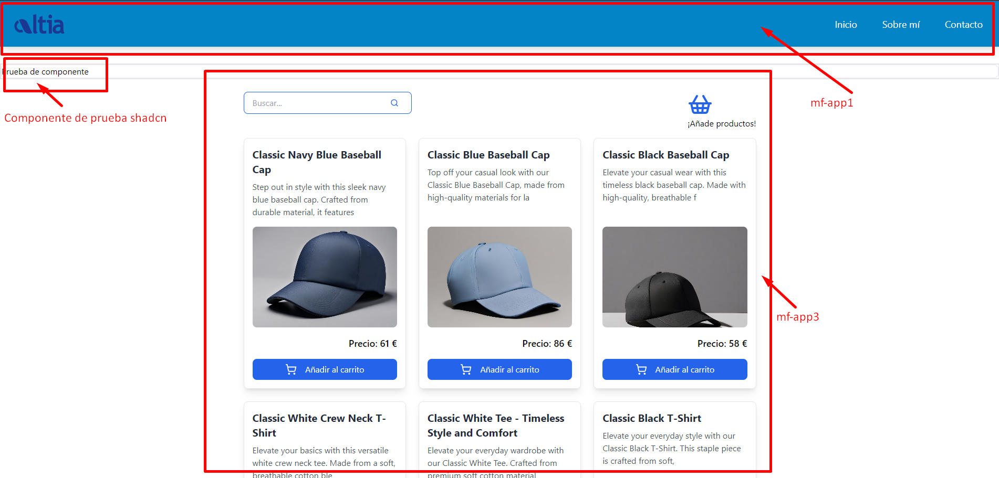
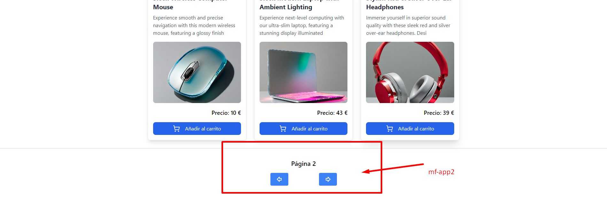

# Microfrontends con React y Webpack

Este proyecto implementa una arquitectura de microfrontends utilizando React y Webpack, permitiendo desarrollar y desplegar aplicaciones modulares e independientes.

## Screenshots



## Tabla de Contenidos

- [Introducción](#introducción)
- [Arquitectura de Microfrontends](#arquitectura-de-microfrontends)
- [Proyectos](#proyectos)
  - [mf-app1](#mf-app1)
  - [mf-app2](#mf-app2)
  - [mf-app3](#mf-app3)
- [Instalación](#instalación)
- [Uso](#uso)
- [Contribución](#contribución)
- [Licencia](#licencia)

## Introducción

Este proyecto utiliza la arquitectura de microfrontends para construir aplicaciones escalables y modulares. Cada microfrontend puede ser desarrollado y mantenido por equipos diferentes, lo que permite una mayor flexibilidad y rapidez en el desarrollo.

## Arquitectura de Microfrontends

La arquitectura de microfrontends permite dividir una aplicación en partes más pequeñas e independientes, llamadas microfrontends. Cada uno de estos puede ser construido y desplegado de manera autónoma. Utilizamos Webpack para gestionar la carga y el empaquetado de nuestros módulos, facilitando así la integración y la optimización.

## Proyectos

### mf-app1

- **Descripción:** Este microfrontend es una aplicación React que proporciona [una breve descripción de la funcionalidad].
- **Estilo:** Este microfrontend utiliza Tailwind CSS para el diseño y la maquetación.

### mf-app2

- **Descripción:** Este microfrontend es responsable de [una breve descripción de la funcionalidad].
- **Zustand:** Se instancia `zustand`, una librería de gestión de estado, que será utilizada por otros microfrontends.
- **Estilo:** Este microfrontend utiliza Tailwind CSS para el diseño y la maquetación.

### mf-app3

- **Descripción:** Esta aplicación React utiliza `@tanstack/react-query` para gestionar consultas a datos remotos.
- **Integración con Zustand:** Utiliza el `middleware` de `zustand` instanciado en `mf-app2` para compartir el estado entre microfrontends.
- **Estilo:** Este microfrontend utiliza Tailwind CSS para el diseño y la maquetación.

## Instalación

Instrucciones para instalar y ejecutar el proyecto en un entorno local.

```bash
# Clonar el repositorio
git clone https://github.com/altia-itx/Altia-Microfrontend.git

# Entrar al directorio del proyecto
cd Altia-microfrontend

# Instalar dependencias
npm install

# Instalar dependencias en cada microfrontend
cd mf-app1
npm install
cd ../mf-app2
npm install
cd ../mf-app3
npm install

# Ejecutar la aplicación
npm start


